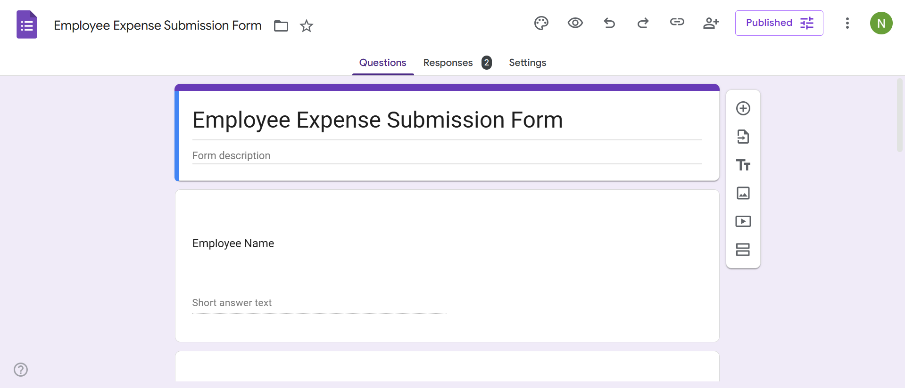
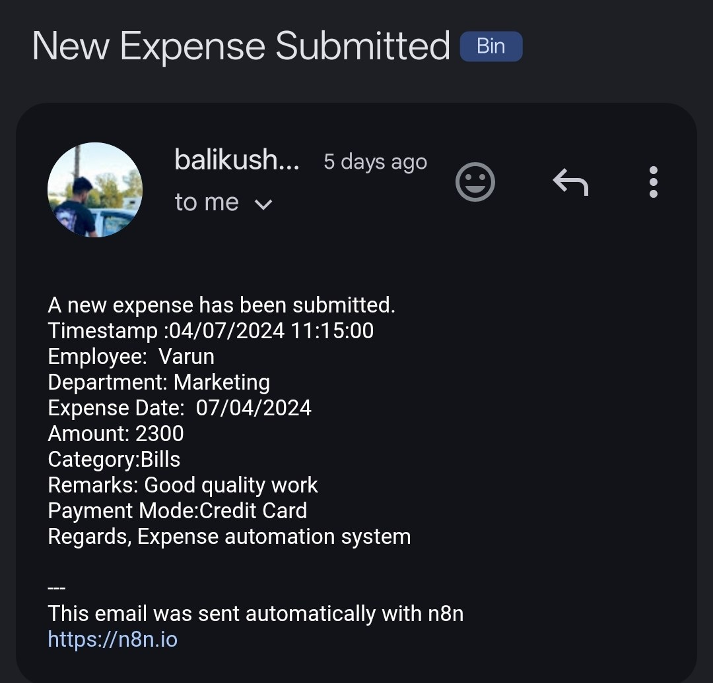
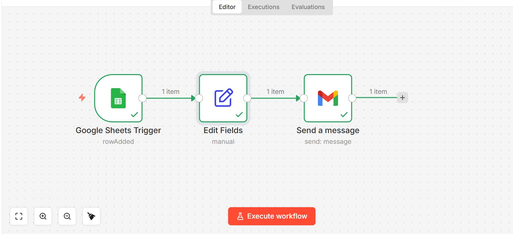
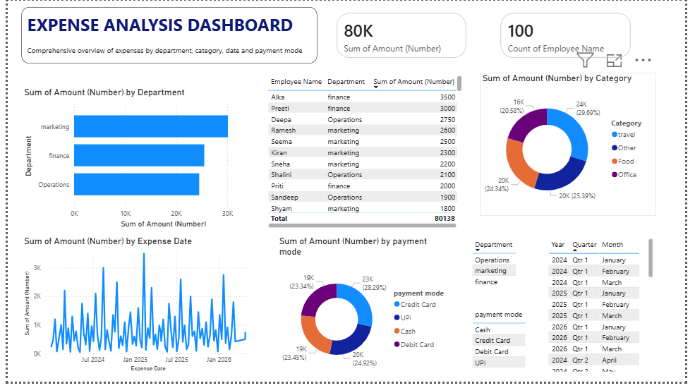

# 🤖 AI Finance Expense Automation System

## 📌 Project Overview

The **AI Finance Expense Automation System** is an intelligent workflow automation project designed to simplify and automate expense tracking, financial data collection, and reporting processes.

This project integrates multiple tools such as:

- Google Forms
- Google Sheets
- n8n Automation
- Power BI Dashboard

The system automatically collects user expense data, processes it through automated workflows, stores it in spreadsheets, and visualizes insights in interactive dashboards.

---

# 🚀 Project Objectives

The main goals of this project are:

✔ Automate expense data collection  
✔ Reduce manual financial tracking  
✔ Create seamless workflow automation  
✔ Generate real-time financial insights  
✔ Improve reporting and analytics  

---

# 🛠️ Technologies Used

| Technology | Purpose |
|------------|----------|
| n8n | Workflow Automation |
| Google Forms | Expense Data Collection |
| Google Sheets | Data Storage |
| Power BI | Data Visualization |
| AI Automation | Process Optimization |

---

# 📂 Project Structure

```bash
├── LICENSE
├── README.md
├── google_form.png
├── google_sheet.png
├── N8n_automation_gmail.jpg
├── n8n_architecture.png.jpeg
└── powerbi_dashboard.png
```

---

# ⚙️ System Workflow

The system works through the following process:

1. User submits expense details using Google Forms
2. Data is automatically stored in Google Sheets
3. n8n automation processes the data
4. Email notifications and automation workflows are triggered
5. Power BI dashboard visualizes expense insights

---

# 🧠 Key Features

## 🔹 Expense Automation

- Automatic expense collection
- Real-time data synchronization
- Reduced manual entry

---

## 🔹 Workflow Automation Using n8n

- Automated triggers
- Data processing workflows
- Gmail/email automation
- Smart integrations

---

## 🔹 Power BI Dashboard

- Expense tracking dashboard
- Financial insights
- Interactive reports
- Data visualization

---

## 🔹 Google Sheets Integration

- Centralized data storage
- Live updates
- Easy accessibility

---

# 📸 Project Screenshots

---

## 📝 Google Form Interface

This form is used to collect user expense details efficiently.



---

## 📊 Google Sheet Data Storage

Submitted form data is automatically stored in Google Sheets.


---

## 🔄 n8n Workflow Automation

The workflow automation handles processing, notifications, and integrations.



---

## 🏗️ System Architecture

Architecture diagram showing the overall automation flow.



---

## 📈 Power BI Dashboard

Interactive dashboard for analyzing expenses and financial trends.



---

# 📊 Dashboard Insights

The Power BI dashboard provides:

- Expense summaries
- Category-wise spending
- Monthly trends
- Automated reports
- Financial analytics

---

# 🎯 Benefits of the System

✅ Saves time through automation  
✅ Reduces human error  
✅ Improves expense tracking  
✅ Provides real-time analytics  
✅ Enhances productivity  
✅ Easy to scale and maintain  

---

# 🔮 Future Enhancements

Future improvements may include:

- AI-based expense prediction
- OCR receipt scanning
- Mobile application integration
- Real-time cloud database
- Multi-user authentication
- Budget recommendation system

---

# ⚙️ Installation & Setup

## Step 1: Clone Repository

```bash
git clone https://github.com/balikushal83-cloud/ai-finance-expense-automation-system.git
```

---

## Step 2: Configure Google Forms & Sheets

- Create a Google Form
- Connect it to Google Sheets
- Enable data collection

---

## Step 3: Setup n8n Workflow

- Import workflow into n8n
- Configure triggers and integrations
- Connect Gmail APIs if required

---

## Step 4: Open Power BI Dashboard

- Open `.pbix` file in Power BI Desktop
- Connect data source
- Refresh dashboard

---

# 📚 Use Cases

This system can be used for:

- Personal finance management
- Business expense tracking
- Automated reporting
- Financial analytics
- Expense approval systems

---

# 👨‍💻 Author

## Kushal Bali

GitHub: [balikushal83-cloud](https://github.com/balikushal83-cloud)

---

# 🤝 Contributing

Contributions are welcome.

To contribute:

1. Fork the repository
2. Create a feature branch
3. Commit your changes
4. Push to your branch
5. Create a Pull Request

---

# ⭐ Support

If you found this project helpful:

⭐ Star this repository  
🍴 Fork the project  
📢 Share it with others  

---

# 📜 License

This project is licensed under the MIT License.

---

# 📧 Contact

For collaboration or queries:

- GitHub: https://github.com/balikushal83-cloud

---
